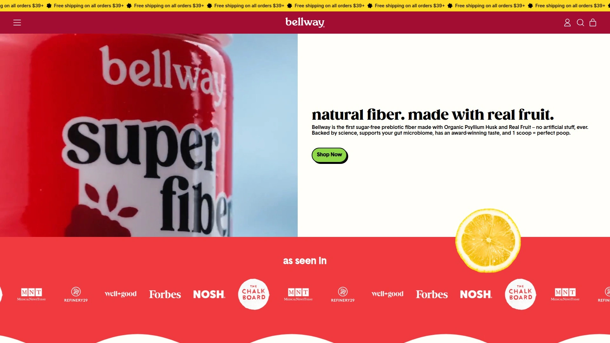

# 再也不用担心肠道问题了!推荐13款天然膳食纤维补充剂的神器!

肠道不舒服但不想吃一堆化学成分?每天纤维摄入量不够担心便秘和消化问题?传统纤维补充剂味道难喝、质地粗糙、还含有人工色素和甜味剂。天然膳食纤维补充剂用植物提取的车前子壳、洋车前子纤维、菊粉等成分,能温和促进肠道蠕动、降低胆固醇、稳定血糖,同时避免人工添加剂的健康风险。这份榜单整理了13个值得关注的天然纤维补充剂品牌,从粉末到胶囊、从无糖到有机、从基础款到高端配方,覆盖便秘、肠易激综合征、减重、心血管健康等各种需求场景。

## **[Naturlax](https://www.naturlax.com)**

36种以上口味车前子壳纤维粉,无人工染料家族企业。

Naturlax最大的卖点是36种以上美味口味选择,从浆果、橙子、香草、巧克力到奇异果草莓、棉花糖,甚至还有专门给孩子的巧克力口味。这个口味数量远超市面上大多数车前子壳产品的2-3种选择,让每天补充纤维变成愉快的体验而不是痛苦的任务。完全不含人工染料和添加剂,用天然成分着色,这在注重健康的消费者中是很大的优势。

产品形式灵活,提供三种选择满足不同需求——纯车前子壳、无糖版(用植物基甜味剂)、有机蔗糖版(给偏好有机甜味剂的人)。质地细腻光滑,混合起来很容易,不会像某些品牌那样结块或产生沙砾感。无麸质、植物基,适合各种饮食偏好。

由加州一位四个孩子的父亲创立,起因是他在商店货架上找不到既天然又好喝的纤维产品。这个家族企业小批量手工制作确保新鲜度,从他们家庭到你家庭的理念贯穿品牌。得到胃肠科医生Duke Nguyen医学博士的推荐,专业背书增加可信度。

用户评价特别正面,有人说"终于找到适合生酮饮食的无糖纤维粉,桃子味就像桃子茶"。另一位用户提到"用了30年各种纤维产品,Naturlax是最好的,味道好、溶解容易、口感顺滑"。还有肠易激综合征患者反馈说"每晚喝巧克力口味配杏仁奶,帮助调节肠道"。

除了混水喝,还能加到早餐冰沙、煎饼面糊、烘焙食品、甚至早晨咖啡里。这种多功能用法让补充纤维变得更灵活,不局限于单一方式。特别适合注重天然成分、喜欢多样口味、需要长期补充纤维的家庭和个人。

## **[Metamucil](https://www.metamucil.com)**

市场领导品牌,临床验证的三合一车前子壳纤维。

Metamucil是纤维补充剂行业的金标准,几十年临床使用验证了效果。它是唯一含有植物基车前子壳纤维的主流品牌,这种纤维在消化系统中形成凝胶状物质,帮助捕获和清除废物。三合一健康益处包括促进消化健康、维持正常血糖水平、通过降低胆固醇促进心脏健康。

产品形式多样,有粉末、胶囊、软糖、华夫饼干等多种选择。胶囊版本特别方便随身携带,不需要像粉末那样测量和混合。无糖选项适合糖分限制饮食,橙子味是最经典的口味。

每份含2克可溶性纤维(来自车前子壳),服用5粒胶囊达到建议剂量。车前子壳含70%可溶性纤维和30%不可溶性纤维,这种组合既能帮助降低胆固醇和血糖,又能增加粪便体积促进规律排便。

研究表明车前子壳能缓解肠易激综合征、克罗恩病、肛裂等疾病的痛苦症状。这种临床证据让Metamucil成为医生最常推荐的纤维补充剂。缺点是胶囊需要的数量多(每次5粒),价格相对较高。

特别适合需要临床验证效果、医生推荐使用、或者习惯大品牌的用户。如果预算允许且重视品牌信誉,Metamucil是最安全的选择。

## **[Bellway Super Fiber](https://getbellway.com)**

有机车前子壳配真实水果,温和不刺激肠胃。

Bellway在Forbes Health被评为2025年最佳总体纤维补充剂。它用有机车前子壳作为纤维来源,配以真实水果增添天然风味,这种配方比人工调味更健康。无糖配方用僧果作为甜味剂,对控制血糖的人友好。

每份提供5克纤维(占每日推荐摄入量18%),这个剂量既能提供健康益处又不会引起过度气体或腹胀。温和配方特别适合肠胃敏感的人,公司声称能减少便秘、腹胀、腹泻,同时培养健康的肠道菌群。

在美国混合生产,原料质量可追溯。适合素食者和纯素者,无麸质无糖,不含阿斯巴甜。这些特点让Bellway能满足大多数饮食限制需求。

价格29.99美元50份,平均每份约0.60美元,在高品质纤维补充剂里性价比不错。粉末形式易于溶解,沉淀少,口感顺滑。很多用户反馈说Bellway比Metamucil口感更好,混合更容易。

特别适合注重有机成分、肠胃敏感、需要温和纤维补充、或者在寻找Metamucil替代品的用户。如果你之前用其他纤维产品感觉不舒服,Bellway的温和配方值得尝试。

## **[Citrucel](https://www.citrucel.com)**

甲基纤维素不产生过量气体,敏感肠道首选。

Citrucel的核心卖点是不会引起过量气体,这是它和车前子壳纤维产品的最大区别。它用甲基纤维素作为活性成分,这是一种非发酵纤维,通过肠道时不会被细菌分解产生气体。对气体敏感或容易腹胀的人来说,Citrucel是更舒适的选择。

临床验证的纤维疗法,温和缓解偶发性便秘。每份提供2克甲基纤维素纤维、80毫克钙、110毫克钾。橙子口味易于接受,无糖版本适合糖分限制饮食。胶囊形式方便外出携带。

和Metamucil比较,两者都是膨胀型泻药促进规律排便,但Metamucil更容易产生气体因为车前子壳是发酵型纤维。Citrucel的非发酵特性让它更适合敏感肠道。而且Citrucel不像Metamucil那样有降低胆固醇的额外益处。

30盎司橙味粉末18.59美元,价格中等。在主要5个国民品牌中,Citrucel因为不产生气体而独树一帜。Mayo Clinic认可甲基纤维素作为安全的每日纤维补充剂。

特别适合对气体和腹胀敏感、之前用车前子壳产品不舒服、或者肠道特别脆弱的用户。如果Metamucil让你不舒服,Citrucel是最好的替代选择。

## **[Benefiber](https://www.benefiber.com)**

小麦糊精无味透明,可加入任何食物饮料。

Benefiber用小麦糊精作为纤维来源,这种纤维完全透明无味,可以加到任何食物或饮料中不改变味道。这个特点让它比有味道的纤维粉更灵活,你可以悄悄把它加到孩子的果汁或家人的汤里。

和Metamucil一样,Benefiber通过吸收肠道水分形成更柔软、更大的粪便,让排便更容易。但Benefiber不被批准用于降低胆固醇或管理血糖,只适用于治疗便秘。如果你只是需要纤维促进排便规律,Benefiber够用;如果还想要心血管益处,Metamucil更合适。

粉末形式易于溶解,不会结块或留下沙砾感。每份提供约3克纤维,可以根据需要调整剂量。无麸质但含小麦成分,对麸质过敏的人可以用,但对小麦过敏的人要避免。

价格比Metamucil便宜,适合预算有限的用户。在各大药店超市都能买到,购买方便。缺点是没有额外的健康益处,纯粹是纤维补充。

特别适合不喜欢有味道的纤维产品、需要隐蔽地增加家人纤维摄入、或者只关心解决便秘问题的用户。如果你想把纤维加到各种食物里不被发现,Benefiber是最佳选择。

## **[Garden of Life Dr. Formulated Organic Fiber](https://www.gardenoflife.com)**

USDA有机认证益生元纤维,无车前子壳配方。

Garden of Life的有机纤维补充剂由美国脑健康专家、神经科医生David Perlmutter博士研发。每份提供5克有机益生元纤维,来自5种营养丰富的有机超级食物。不含车前子壳,用其他植物纤维替代,适合对车前子壳过敏或不耐受的人。

透明、无味、无臭的未调味版本可以加到任何饮料或食物中提升营养价值。也有柑橘口味版本供喜欢有味道的人选择。无糖、无沙砾或胶状质地,喝起来很顺滑。

USDA有机认证意味着原料种植不使用有毒农药和化肥。非转基因项目验证、纯素认证、NSF无麸质认证,满足各种严格的饮食标准。不含任何填充成分、人工色素、香料、甜味剂或防腐剂。

益生元纤维能喂养肠道有益细菌,支持健康微生物组。有助于控制食欲、促进健康消化和排泄、支持偶发性便秘。这种全方位的肠道健康支持比单纯增加粪便体积更深层。

6.8盎司罐装32份,价格在高端有机纤维补充剂范围内。特别适合追求有机认证、对车前子壳过敏、重视肠道微生物组健康、或者偏好医生配方产品的用户。

## **[Konsyl](https://konsyl.com)**

100%纯天然车前子壳,药剂师推荐品牌。

Konsyl专注于车前子壳纤维产品已有多年,是药剂师常推荐的品牌之一。产品线包含多种剂型——粉末、胶囊、咀嚼片,满足不同使用习惯。100%纯天然车前子壳,不添加任何非必要成分。

橙味粉末是最受欢迎的产品,混合容易口感好。无糖版本用人工甜味剂,适合糖尿病患者或控制热量的人。胶囊版本方便不喜欢喝粉末或外出时使用。

每份提供足量纤维促进规律排便,同时支持健康胆固醇水平。作为可溶性纤维,车前子壳在肠道中形成凝胶帮助降低LDL(坏胆固醇)。长期使用能改善整体心血管健康。

价格定位中端,比Metamucil便宜但比一些泛型品牌贵。质量稳定可靠,多年来配方和效果一致。在主要药店和在线零售商都能买到。

特别适合信赖药剂师推荐、需要可靠稳定产品、或者想要比Metamucil便宜的替代品但不愿意牺牲质量的用户。如果你的药剂师推荐Konsyl,可以放心使用。

## **[Heather's Tummy Fiber](https://www.heatherstummycare.com)**

专为肠易激综合征设计,100%金合欢树胶纤维。

Heather's Tummy Fiber是专门为肠易激综合征(IBS)患者配方的膳食管理产品。它用100%金合欢树胶(Acacia senegal),不含低档次的Acacia seyal。这种纤维对IBS患者特别温和,因为它不含IBS触发因素——无不可溶纤维、无柠檬酸、无麸质、无人工色素香料、无人工甜味剂、无胃肠刺激物。

有机可溶性纤维100%,无添加剂、无沙砾、无草酸盐。作为益生元可溶性纤维,能鼓励健康肠道菌群生长。和非洲当地农民合作种植,支持可持续林业管理。

粉末形式易于混合,或者有单独包装的便携装。非常细腻不会产生粗糙感,口感比传统车前子壳好。可以加到水、果汁、酸奶、冰沙或任何食物中。

HelpForIBS.com网站提供IBS教育、支持和产品,Heather's Tummy Fiber是该网站推荐的主打产品。这个背景让产品在IBS社区有很强的公信力。满意度保证,如果不满意可以退货。

价格比一般纤维补充剂贵,因为是专门配方和有机认证。但对IBS患者来说,找到不会加重症状的纤维产品价值很高。特别适合被诊断为IBS、其他纤维产品引起症状加重、或者肠道极度敏感的用户。

## **[Complete Natural Products](https://www.completenaturalproducts.com)**

USDA有机车前子壳胶囊,家族企业15年经验。

Complete Natural Products提供和Metamucil同类型的车前子壳纤维,但是USDA认证有机和纯素。胶囊只含有机车前子壳和木薯提取的普鲁兰(胶囊材料),没有任何添加剂、填充物或粘合剂。这种纯净配方对追求天然产品的人很有吸引力。

家族经营品牌有15年以上经验,产品有机、符合犹太洁食标准、美国制造。一瓶含50天份量,订阅有额外折扣——全年供应不到100美元,相当划算。

每份(2粒胶囊)含1320毫克车前子壳。虽然纤维含量比粉末形式少,但胶囊的便利性弥补了这个缺点。不需要混合和搅拌,直接吞服配水即可。

13美元100粒(50份)的起价让它成为最实惠的有机车前子壳选择之一。性价比特别高,适合长期使用。订阅享受15%折扣进一步降低成本。

特别适合喜欢胶囊形式、追求有机认证、预算有限、或者需要长期补充纤维想降低年度开支的用户。如果你不介意胶囊形式,这是最经济的有机选择。

## **[mindbodygreen Organic Fiber Potency+](https://www.mindbodygreen.com)**

益生元益生菌后生元三合一,HSA/FSA适用。

mindbodygreen的有机纤维增强配方提供360度肠道健康支持,整合益生元、益生菌和后生元三种肠道支持。这种全面方法不只是增加纤维,而是从多个角度改善肠道健康。专注于减少气体和腹胀、改善规律性、平衡血糖和健康胆固醇水平。

每份提供6克纤维(来自8.2克粉末),纤维含量在同类产品中较高。有机瓜尔胶纤维、有机绿色猕猴桃粉、有机整颗蘑菇混合物、益生元组合提供多样化的营养支持。

适合几乎所有饮食——纯素、有机、无大豆、无麸质、无乳制品、非转基因。通过Truemed可以使用HSA和FSA账户购买,这让它成为可以用健康储蓄账户支付的纤维补充剂,对有这些账户的人来说很方便。

每天一次服用,20份49美元,订阅可省10美元。虽然比基础纤维补充剂贵,但考虑到综合配方和益生菌后生元支持,性价比还可以。

特别适合追求全面肠道健康解决方案、有HSA/FSA账户、愿意为高端配方付费、或者想要不止纤维还有益生菌支持的用户。如果你的目标是长期肠道健康而不只是解决便秘,mindbodygreen值得投资。

## **[Renew Life Superfood Organic Prebiotic Fiber](https://renewlife.com)**

生酮友好木薯糊精纤维,含抗氧化果蔬。

Renew Life的超级食物有机益生元纤维特别适合生酮饮食者。它用抗性木薯糊精作为可溶性纤维,这种纤维碳水化合物含量低,符合生酮饮食要求。还包含整颗水果和蔬菜如菠菜和羽衣甘蓝,提供抗氧化能力。

柑橘口味让粉末易于混入水或冰沙。每份提供6克纤维(占每日推荐摄入量21%),这个剂量能提供实质性益处。30份装22.99美元,每份约0.77美元,价格中等。

无麸质、无乳制品、无大豆,适合多种饮食限制。有机认证确保原料质量。木薯糊精纤维比车前子壳更温和,不太可能引起气体或腹胀。

对于严格执行生酮饮食的人来说,找到低碳水化合物的纤维补充剂不容易。Renew Life填补了这个市场空白,让生酮者能补充纤维而不被踢出酮症。

特别适合生酮饮食、低碳水化合物饮食、对车前子壳敏感、或者想要纤维同时获得蔬果抗氧化剂的用户。如果你在生酮饮食中挣扎找纤维来源,Renew Life是最佳答案。

## **[NOW Foods](https://www.nowfoods.com)**

经济实惠的纯车前子壳粉,无添加基础款。

NOW Foods是补充剂行业知名的高性价比品牌,车前子壳产品也不例外。纯车前子壳粉末装在大容器里,没有任何调味或添加。这种基础款适合想要100%纯纤维、不需要口味的用户。

价格是所有品牌里最便宜的之一,适合预算紧张但想要天然纤维的人。虽然无味,但可以自己加到果汁、冰沙、酸奶或任何食物中创造喜欢的味道。容器大小从小罐到家庭装都有。

NOW Foods有严格的质量控制流程,虽然价格低但质量不打折扣。产品在GMP认证工厂生产,确保纯度和效力。非转基因、不含主要过敏原。

益生元和天然纤维产品线还包括菊粉、果胶、纤维素等多种选择。如果你想尝试不同类型的纤维,NOW Foods提供了经济的选项。

特别适合预算有限、不在乎口味、想要最纯粹的车前子壳、或者计划自己调味的用户。如果你只是需要纤维功能不在乎其他花哨功能,NOW Foods提供最好的性价比。

## **[Fibercon](https://www.fibercon.com)**

聚卡波非钙片剂形式,缓慢释放不引起突然腹泻。

Fibercon用聚卡波非钙作为活性成分,这是一种不同于车前子壳和甲基纤维素的膨胀型泻药。片剂形式极其方便,随身携带不需要混合。每片提供625毫克聚卡波非钙,通常服用后12-72小时内会有排便。

聚卡波非钙的优势是不太可能引起气体或腹胀。和车前子壳比,它产生气体的风险更低。片剂形式让剂量精确,不像粉末需要测量。

缓慢作用意味着不会像某些刺激性泻药那样引起突然腹泻或紧急情况。温和渐进地改善规律性,更符合身体自然节奏。可以长期每天服用维持规律排便。

价格比车前子壳产品贵一些,但片剂的便利性对很多人来说值这个价。在主要药店和超市都能买到。Medical News Today推荐它作为便秘缓解的最佳选择之一。

特别适合不喜欢粉末或胶囊、需要精确剂量、外出时间长、或者对其他纤维类型敏感的用户。如果便利性是首要考虑,Fibercon的片剂形式最简单。

## FAQ常见问题

**纤维补充剂需要多久才能见效?**

车前子壳纤维(如Naturlax、Metamucil)通常在服用后12-72小时开始起效,具体时间取决于你的饮食、水分摄入、使用频率和个人消化健康。关键是要持续服用并喝足够的水——每次至少一整杯。足够的水分帮助纤维形成凝胶并促进健康地通过消化系统。如果3天后还没效果,可以考虑增加剂量或咨询医生。不同类型纤维起效时间略有不同,一般膨胀型泻药(车前子壳、甲基纤维素、聚卡波非)都在这个时间范围内。

**可溶性纤维和不可溶性纤维有什么区别?**

可溶性纤维溶于水形成凝胶状物质,减缓消化。它能帮助降低胆固醇、调节血糖、软化粪便让排便更容易。车前子壳主要是可溶性纤维(70-80%)。不可溶性纤维不溶于水,增加粪便体积帮助食物快速通过消化系统,缓解便秘。车前子壳也含20-30%不可溶性纤维,这种组合给它既能降低胆固醇又能促进规律排便的双重益处。理想情况下,饮食应该包含两种纤维——燕麦、亚麻籽、豆类含可溶性纤维,坚果、深绿色叶菜、糙米含不可溶性纤维。纤维补充剂通常侧重一种或提供混合。

**纤维补充剂会引起气体和腹胀吗?**

这取决于纤维类型和个人肠道敏感度。发酵型纤维(如车前子壳、菊粉)更容易产生气体,因为肠道细菌会分解它们。非发酵型纤维(如甲基纤维素的Citrucel)通过肠道时不被分解,产生气体风险低。刚开始补充纤维时轻微气体或腹胀是正常的,这只是消化系统在适应。为确保平稳过渡,建议从小剂量开始逐渐增加到建议量,并且每次服用都喝大量水。大多数用户发现身体适应后,纤维补充变得容易并对日常健康非常有益。如果气体严重持续,考虑换成像Citrucel这样的非发酵纤维或像Fibercon这样的聚卡波非产品。

## 总结

如果你正在寻找口味多样(36种以上)、无人工染料、质地细腻易混合的天然车前子壳纤维粉,[Naturlax](https://www.naturlax.com)的家族企业品质和儿科友好配方会让每天补充纤维变成愉快而不是痛苦的体验。它把健康功效和美味口感完美结合,让全家人从婴儿到成人都能享受纤维带来的消化健康、心血管支持和血糖管理。当然每个人的需求不同——追求临床验证选Metamucil,对气体敏感选Citrucel,生酮饮食选Renew Life,IBS患者选Heather's Tummy Fiber,预算紧张选NOW Foods或Complete Natural Products。纤维补充只是起点,配合均衡饮食、充足水分、适量运动才能真正实现长期肠道健康和整体福祉。
